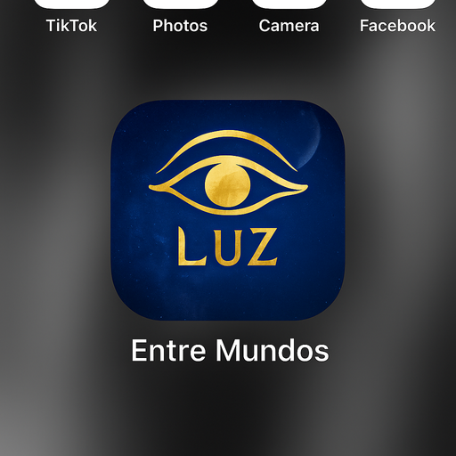

# Entre Mundos — Dia 1

*Lançamento oficial: 11 de agosto de 2025*

> Guia espiritual diário — mensagem, respiração, frase e silêncio.  
> Conecta-te à tua essência e reencontra a tua luz.

**📲 [Instalar a App](https://19800925.github.io/entre-mundos-dia1/)**

## Conteúdo do Dia 1
- **Guia Espiritual** — mensagem de reconexão
- **Respiração** 4•4•4•4 com animação
- **Frase Âncora**
- **Silêncio** com temporizador
- **Escrita da Alma** (guardado no dispositivo)

## Como publicar no GitHub Pages
1. Faz upload de todos os ficheiros deste repositório.
2. Vai a *Settings → Pages*.
3. Em **Source**, escolhe `Deploy from a branch`.
4. Seleciona a branch `main` e a pasta `/ (root)` e guarda.
5. Abre: https://19800925.github.io/entre-mundos-dia1/ (ou o link que o GitHub indicar).
